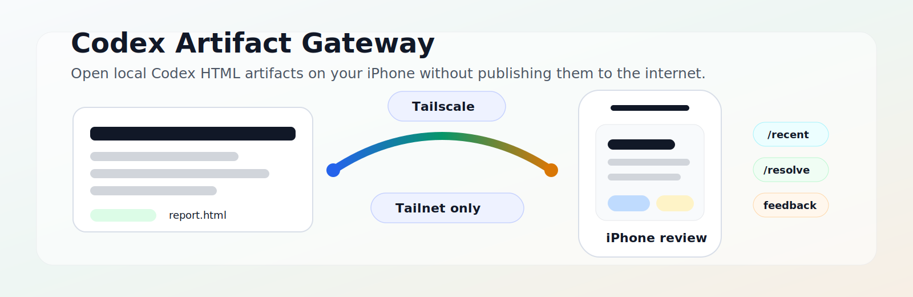
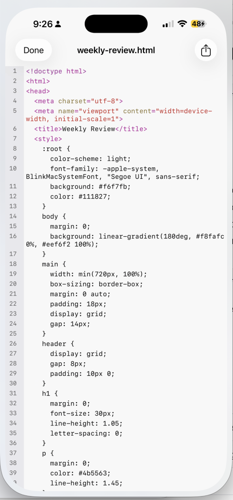
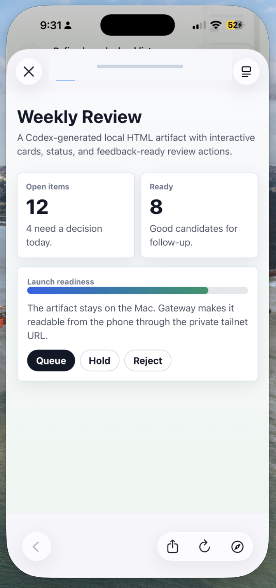

<p align="center">
  
</p>

# Codex Artifact Gateway

Open local Codex-generated HTML artifacts on your iPhone or iPad without uploading them to the public internet.

Codex Artifact Gateway is a small macOS utility for a very specific workflow: Codex makes a useful local HTML artifact, and you want to review it from a trusted mobile device while it stays on your Mac. Gateway runs locally, serves only the folders you allowlist, and uses Tailscale Serve so the review URL is available on your private tailnet.

This project is unofficial. It is not an OpenAI product and does not imply OpenAI ownership or endorsement.

## Why I Built This

Codex is very good at producing local HTML review surfaces: dashboards, reports, prototypes, comparison pages, and feedback workbenches. Those files are useful, but the moment you want to review one from your phone, the normal `file:///Users/...` link stops working.

The boring solution is to upload the artifact somewhere. I do not want that to be the default.

Gateway keeps the artifact where it belongs: on the Mac that produced it. It gives trusted devices on your tailnet a private way to open the page, keep the page's client-side interactivity, and optionally leave feedback that is saved locally.

## What Changes On The Phone

Without Gateway, the phone usually gets stuck with a Mac-only `file:///Users/...` path or raw local HTML that it cannot reach. With Gateway, the same artifact opens as a private, rendered review page on the phone.

| Without Gateway | With Gateway |
| --- | --- |
| Raw HTML on the phone. | Rendered through the private Gateway URL. |
|  |  |

## What It Does

- Opens local Codex-generated HTML files from an iPhone, iPad, or trusted browser on your tailnet.
- Finds recent HTML artifacts under allowlisted roots.
- Resolves local paths and `file:///Users/...` URLs into private `/view/...` links.
- Preserves client-side behavior already in the page, including JavaScript, filters, tabs, charts, forms, and relative assets.
- Adds a lightweight feedback drawer at response time without modifying the original HTML file.
- Saves feedback locally as append-only JSONL on the Mac.
- Installs as a user-level macOS LaunchAgent and configures Tailscale Serve.
- Rejects files outside configured roots and blocks private path components such as `.codex`, `.ssh`, and top-level `Library`.

## What It Is Not

Gateway is intentionally narrow. It is not a public file host, a whole-home-directory file server, a SaaS product, a reverse proxy for arbitrary app APIs, or an approval system for publishing, sending, merging, or mutating external systems.

If a page depends on a separate backend API to save state or perform app-specific actions, serve that page through the app that owns that backend. Gateway is for private artifact viewing and local feedback capture.

## The Two Folders To Understand

Gateway has two different folders in the setup flow:

| Folder | What it means | Example |
| --- | --- | --- |
| Install location | Where this repo and the built `codex-artifact-gateway` binary live. Do not move or delete it unless you run setup again. | `~/Developer/codex-artifact-gateway` |
| Artifact root | A folder containing HTML files Gateway is allowed to open on your phone. Subfolders are included. | `~/Documents/Codex` |

Install Gateway somewhere stable, not in Downloads, Trash, `/tmp`, or a throwaway scratch folder. The macOS background service remembers the exact binary path from setup.

## How Pages Get To The Phone

Once Gateway is set up, there are three practical ways to open an artifact:

1. Open the phone URL printed by setup, then choose **Browse recent HTML files**.
2. Choose **Paste a file path**, paste a local path or `file:///` URL, and Gateway redirects to the private viewer URL.
3. Use an `/open?path=...` link when another tool already knows the local file path.

Gateway does not automatically rewrite every old `file:///...` link that already exists in chats, emails, notes, or generated pages. It provides the resolver that makes those paths usable from the phone. Future tools can generate Gateway `/open?path=...` links directly, but existing plain file links still need to go through `/resolve` or be converted by the tool that emits them.

## How It Works

1. Install Gateway in a stable folder on your Mac.
2. Run `setup` with one or more artifact roots you are comfortable exposing to trusted tailnet devices.
3. Gateway starts a local server on `127.0.0.1:8767`.
4. Tailscale Serve exposes that local server to your tailnet.
5. Setup prints the private phone URL to open.
6. Feedback, if submitted, is appended to a local JSONL file.

## Support Matrix

| Area | Supported in v0.1 |
| --- | --- |
| Host | macOS user session |
| Client | iPhone/iPad browser on the same tailnet |
| Network exposure | Localhost plus Tailscale Serve |
| Artifact type | Codex-generated local HTML and relative assets |
| Interactivity | Client-side JavaScript already present in the page |
| Feedback | Local append-only JSONL |
| Public internet | Not supported |
| Backend API proxying | Not supported |

## Quick Start

Prerequisites:

- macOS.
- Go 1.22 or newer.
- Tailscale installed and signed in on the Mac.
- Tailscale installed and signed in on the iPhone, iPad, or trusted device you want to use.

Clone this repo into a stable folder and build the binary:

```bash
mkdir -p "$HOME/Developer"
cd "$HOME/Developer"
git clone https://github.com/jdfetterly/codex-artifact-gateway.git
cd codex-artifact-gateway
go build ./cmd/codex-artifact-gateway
```

Install and start Gateway as your logged-in macOS user:

```bash
./codex-artifact-gateway setup \
  --root "$HOME/Documents/Codex"
```

Prefer narrow artifact roots. Repeat `--root` for each local artifact tree the phone should be able to open:

```bash
./codex-artifact-gateway setup \
  --root "$HOME/Documents/Codex" \
  --root "$HOME/Reference"
```

Avoid broad roots such as `$HOME`. Anyone with access to the tailnet URL should be treated as able to view supported files under the configured roots, so each root should map to an artifact tree you are comfortable reviewing from trusted mobile devices.

The setup command:

- writes `~/Library/Application Support/codex-artifact-gateway/config.json`
- saves the configured allowlisted roots
- installs a user LaunchAgent
- starts the local gateway on `127.0.0.1:8767`
- configures Tailscale Serve
- prints the private phone URL to open

Gateway uses local port `8767`. If another app is already using `127.0.0.1:8767`, setup will not be able to start the local service.

Check or stop Gateway:

```bash
./codex-artifact-gateway status
./codex-artifact-gateway doctor
./codex-artifact-gateway stop
```

`stop` also disables the managed Tailscale Serve proxy so the tailnet URL does not point at a stale local port.

First-run check:

1. Run `./codex-artifact-gateway doctor`.
2. Open `http://127.0.0.1:8767/` on the Mac.
3. Open the printed Tailscale URL from the phone.
4. Choose **Browse recent HTML files** or **Paste a file path**.

## Common Workflows

Open recent artifacts locally:

```text
http://127.0.0.1:8767/recent
```

Open the local Gateway home page:

```text
http://127.0.0.1:8767/
```

Open a specific local HTML file:

```text
http://127.0.0.1:8767/open?path=file:///Users/example/report.html
```

Paste an existing local path or `file:///` URL:

```text
http://127.0.0.1:8767/resolve
```

Serve manually for development:

```bash
go run ./cmd/codex-artifact-gateway serve \
  --root /path/to/codex-artifacts
```

Serve from a saved setup config:

```bash
./codex-artifact-gateway serve \
  --config "$HOME/Library/Application Support/codex-artifact-gateway/config.json"
```

## Feedback Logs

By default, feedback is appended under the configured feedback directory:

```text
~/Documents/Codex/codex-artifact-gateway-feedback/YYYY-MM-DD-feedback.jsonl
```

Override this with:

```bash
./codex-artifact-gateway serve \
  --root /path/to/codex-artifacts \
  --feedback-dir /path/to/feedback
```

Feedback may contain user-controlled text, URLs, browser metadata, and artifact references. Do not put secrets, credentials, private paths, or instructions for external actions in feedback, and escape or sanitize feedback before displaying it in another tool.

## Security Model

Gateway is private by default:

- The local server binds to `127.0.0.1:8767`.
- Mobile access is intended to go through Tailscale Serve to trusted tailnet devices.
- Artifact roots must be explicitly allowlisted.
- Private path components are rejected even when a broad root is configured.
- Feedback is treated as untrusted user input.
- Gateway should run as your logged-in macOS user, not with `sudo`.

Do not expose Gateway with Tailscale Funnel, public tunnels, reverse proxies, public interfaces such as `0.0.0.0`, or generic file-hosting infrastructure.

Anyone who can access the tailnet URL should be treated as able to view supported files under the configured allowlisted roots. Tailnet access is not per-file authorization.

## Project Status

The current implementation supports the first public milestone: macOS host, iPhone/iPad browser review over Tailscale, Codex-generated HTML artifacts, local feedback capture, explicit allowlisted roots, and a Go single-binary build from source.

Release packaging is intentionally minimal for the initial launch. Future packaging may include Homebrew after the source-build path has been validated from a clean checkout.

## Contributing

Contributions are welcome, especially fixes that make Gateway easier to install, safer to run, or clearer for people reviewing local Codex artifacts from a phone.

This project is intentionally narrow. Before opening a large PR, please check that the change fits the current scope:

- macOS host.
- iPhone/iPad or trusted browser client.
- Tailscale-only private access.
- Codex-generated local HTML artifacts.
- Local feedback capture.
- Explicit allowlisted roots.
- Go standard library first.

Please do not send PRs that turn Gateway into public hosting, generic file sharing, a SaaS service, a broad tunnel manager, an arbitrary reverse proxy, or a system that treats feedback as approval to mutate files or call external services.

### Submitting PRs

For a smooth review:

1. Open an issue first for large features, security-sensitive changes, or anything that changes the project scope.
2. Keep PRs focused. One behavior change is easier to review than a bundle of unrelated cleanup.
3. Include a short explanation of the user problem, the change, and how you tested it.
4. Add or update tests for path policy, server behavior, setup/status output, or feedback handling when those areas change.
5. Run the standard checks before submitting:

```bash
go test ./...
go vet ./...
git diff --check
```

Security-sensitive reports should follow [SECURITY.md](SECURITY.md), not a public issue or PR.

## Development

Run tests:

```bash
go test ./...
```

Check static issues:

```bash
go vet ./...
```

Core files:

- `cmd/codex-artifact-gateway/main.go`: CLI entrypoint.
- `internal/server`: HTTP routes and artifact serving.
- `internal/gateway`: path policy, feedback storage, and HTML injection.
- `internal/app`: setup, status, LaunchAgent, and Tailscale orchestration.
- `internal/config`: local config paths and defaults.
- `internal/launchd`: user LaunchAgent plist generation.
- `internal/tailscale`: Tailscale CLI integration.

## Documentation

- [SCOPE_AND_OUTCOMES.md](SCOPE_AND_OUTCOMES.md): v0.1 boundary, success criteria, and deferred ideas.
- [SECURITY.md](SECURITY.md): supported security boundary and reporting guidance.
- [AGENTS.md](AGENTS.md): working rules for future agents and contributors.

## License

Copyright 2026 JD Fetterly.

Licensed under the Apache License, Version 2.0. See [LICENSE](LICENSE).
